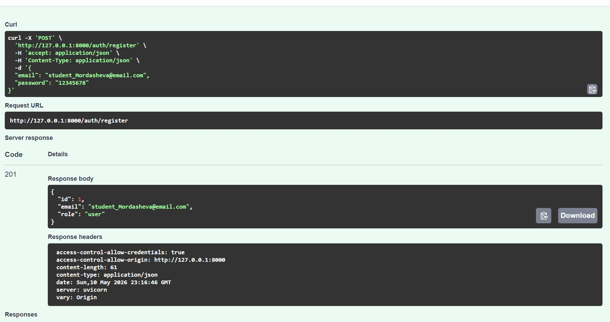
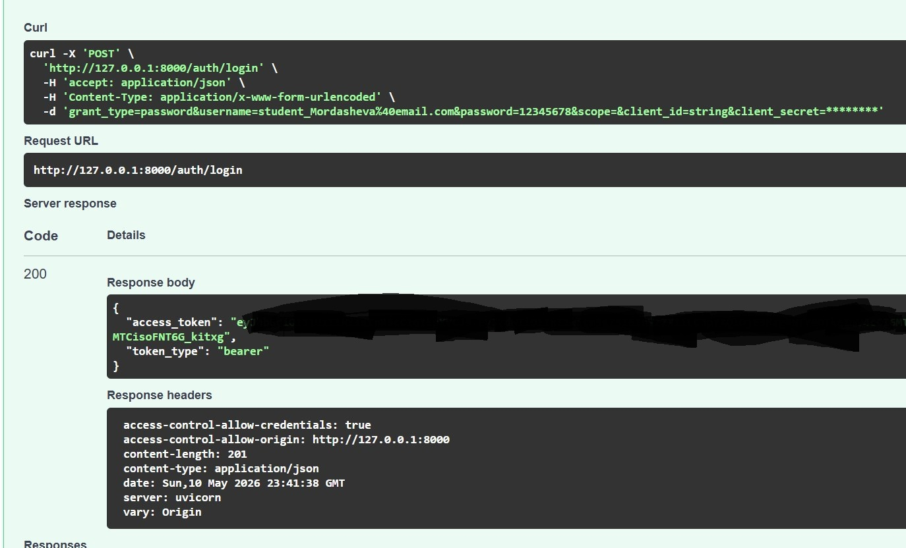
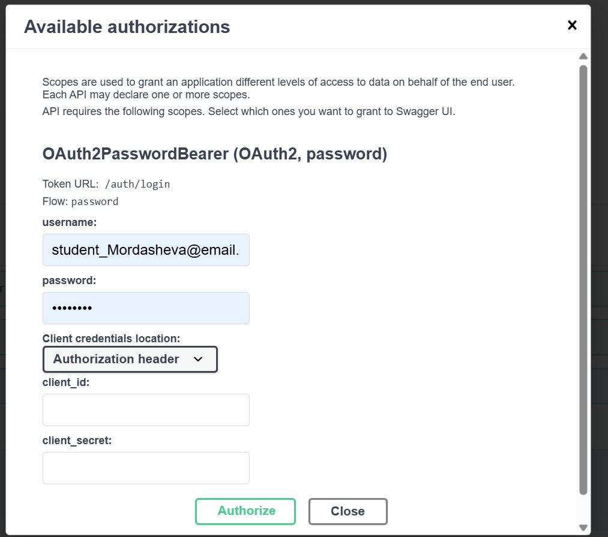
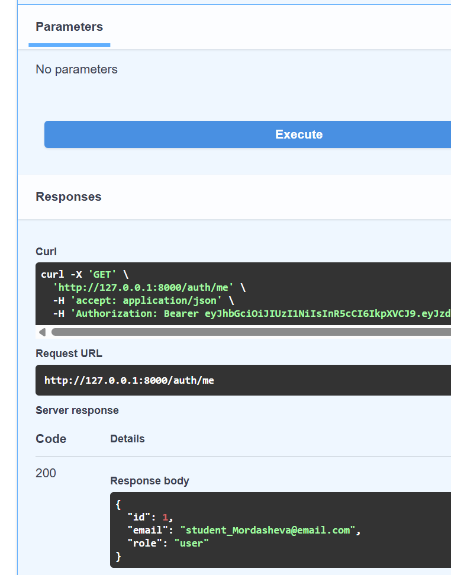
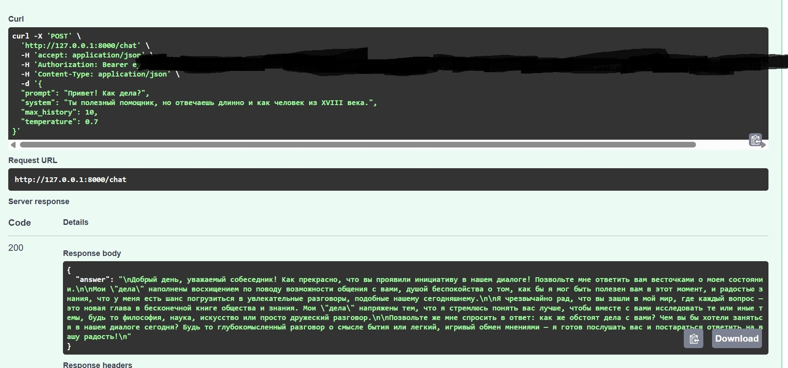
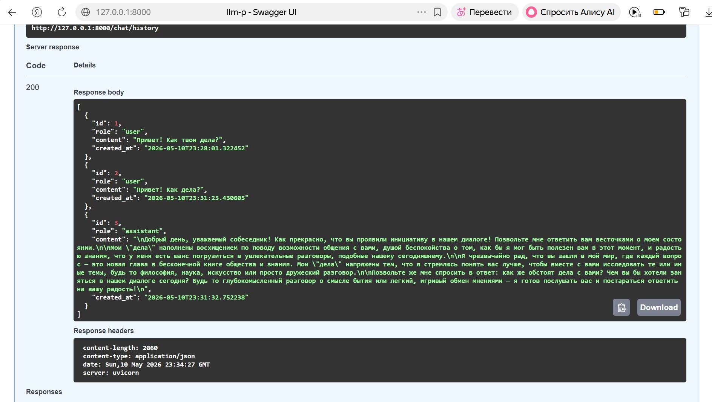
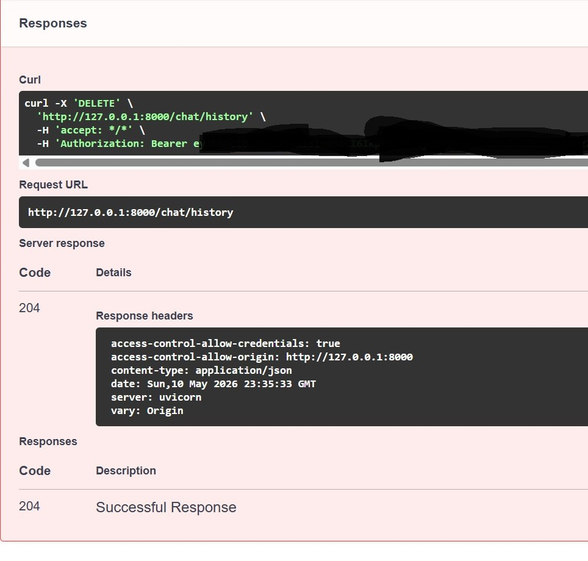
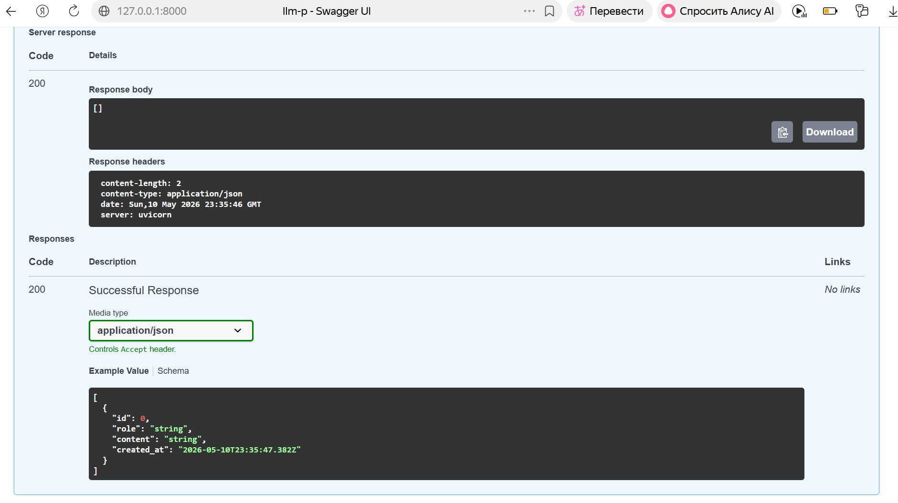

FastAPI-сервис для работы с большой языковой моделью через OpenRouter.

Проект реализует защищённый API с регистрацией пользователей, авторизацией через JWT, хранением пользователей и истории диалога в SQLite, а также отправкой запросов к LLM через внешний сервис OpenRouter.

## Возможности проекта

- Регистрация пользователя.
- Вход пользователя и получение JWT access token.
- Защита эндпоинтов через Bearer Token.
- Отправка сообщений к LLM через OpenRouter.
- Сохранение истории диалога в SQLite.
- Получение истории текущего пользователя.
- Удаление истории текущего пользователя.
- Разделение приложения на слои: API, usecases, repositories, services, database, schemas, core.

## Стек технологий

- Python 3.12
- FastAPI
- Uvicorn
- SQLAlchemy Async
- SQLite
- Pydantic
- JWT
- Passlib + bcrypt
- HTTPX
- OpenRouter API
- uv
- Ruff

## Структура проекта

```text
llm-p/
├── pyproject.toml
├── README.md
├── .env.example
├── requirements.txt
├── app/
│   ├── __init__.py
│   ├── main.py
│   ├── core/
│   │   ├── __init__.py
│   │   ├── config.py
│   │   ├── security.py
│   │   └── errors.py
│   ├── db/
│   │   ├── __init__.py
│   │   ├── base.py
│   │   ├── session.py
│   │   └── models.py
│   ├── schemas/
│   │   ├── __init__.py
│   │   ├── auth.py
│   │   ├── user.py
│   │   └── chat.py
│   ├── repositories/
│   │   ├── __init__.py
│   │   ├── users.py
│   │   └── chat_messages.py
│   ├── services/
│   │   ├── __init__.py
│   │   └── openrouter_client.py
│   ├── usecases/
│   │   ├── __init__.py
│   │   ├── auth.py
│   │   └── chat.py
│   └── api/
│       ├── __init__.py
│       ├── deps.py
│       ├── routes_auth.py
│       └── routes_chat.py
└── screenshots/
    ├── 01_register.jpg
    ├── 02_login.jpg
    ├── 03_authorize.jpg
    ├── 04_auth_me.png
    ├── 05_chat.jpg
    ├── 06_history.jpg
    ├── 07_delete_history.jpg
    └── 08_empty_history.jpg
```

## Установка и запуск

### 1. Перейти в папку проекта

### 2. Создать виртуальное окружение

```powershell
uv venv
```

### 3. Активировать виртуальное окружение

```powershell
.\.venv\Scripts\Activate.ps1
```

### 4. Установить зависимости

```powershell
uv pip compile pyproject.toml -o requirements.txt
uv pip install -r requirements.txt
```

## Настройка переменных окружения

В корне проекта необходимо создать файл `.env`.

Пример содержимого:

```env
APP_NAME=llm-p
ENV=local

JWT_SECRET=change_me_super_secret
JWT_ALG=HS256
ACCESS_TOKEN_EXPIRE_MINUTES=60

SQLITE_PATH=./app.db

OPENROUTER_API_KEY=your_openrouter_api_key
OPENROUTER_BASE_URL=https://openrouter.ai/api/v1
OPENROUTER_MODEL=openrouter/free
OPENROUTER_SITE_URL=https://example.com
OPENROUTER_APP_NAME=llm-fastapi-openrouter
```

В строку `OPENROUTER_API_KEY=` необходимо вставить API-ключ, полученный на платформе OpenRouter.

В проекте используется модель:

```text
openrouter/free
```

Изначально в задании была указана модель `stepfun/step-3.5-flash:free`, но на момент тестирования она была недоступна через OpenRouter. Поэтому была использована разрешённая бесплатная модель `openrouter/free`.

## Запуск приложения

```powershell
uv run uvicorn app.main:app --reload --host 127.0.0.1 --port 8000
```

После запуска приложение доступно по адресу:

```text
http://127.0.0.1:8000
```

Swagger UI доступен по адресу:

```text
http://127.0.0.1:8000/docs
```

## Проверка health endpoint

Эндпоинт:

```text
GET /health
```

Пример ответа:

```json
{
  "status": "ok",
  "env": "local"
}
```

## API endpoints

### Auth

| Метод | Endpoint | Описание |
|---|---|---|
| POST | `/auth/register` | Регистрация пользователя |
| POST | `/auth/login` | Вход пользователя и получение JWT |
| GET | `/auth/me` | Получение профиля текущего пользователя |

### Chat

| Метод | Endpoint | Описание |
|---|---|---|
| POST | `/chat` | Отправка запроса к LLM |
| GET | `/chat/history` | Получение истории диалога |
| DELETE | `/chat/history` | Удаление истории диалога |

## Демонстрация работы

### 1. Регистрация пользователя

Для регистрации использовался email в требуемом формате:

```text
student_mordasheva@email.com
```

Эндпоинт:

```text
POST /auth/register
```

На скриншоте видно успешную регистрацию пользователя: сервер вернул код `201`, email пользователя и роль `user`.



---

### 2. Логин и получение JWT

Эндпоинт:

```text
POST /auth/login
```

Для входа использовался тот же email:

```text
student_mordasheva@email.com
```

Сервер вернул код `200`, `access_token` и `token_type: bearer`.



---

### 3. Авторизация через Swagger

После получения JWT-токена была выполнена авторизация через кнопку `Authorize` в Swagger UI.



---

### 4. Проверка текущего пользователя

Эндпоинт:

```text
GET /auth/me
```

После авторизации защищённый эндпоинт успешно вернул данные текущего пользователя.



---

### 5. Отправка запроса к LLM

Эндпоинт:

```text
POST /chat
```

В запросе был отправлен prompt к языковой модели через OpenRouter. Сервер вернул код `200` и ответ модели в поле `answer`.



---

### 6. Получение истории диалога

Эндпоинт:

```text
GET /chat/history
```

История диалога возвращает сообщения текущего пользователя и ответы ассистента.



---

### 7. Удаление истории диалога

Эндпоинт:

```text
DELETE /chat/history
```

После успешного удаления истории сервер вернул код `204`.



---

### 8. Проверка пустой истории после удаления

После удаления истории повторный запрос к эндпоинту:

```text
GET /chat/history
```

вернул пустой список `[]`.



## Проверка качества кода

Для проверки кода используется Ruff.

Команда:

```powershell
uv run ruff check
```

Результат:

```text
All checks passed!
```

## Примечание по безопасности

Файл `.env` содержит секретные данные, включая `OPENROUTER_API_KEY` и `JWT_SECRET`, поэтому его нельзя публиковать в открытом доступе.